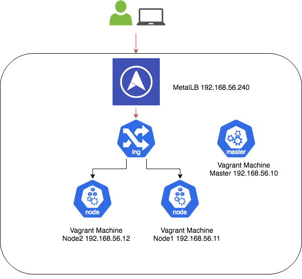

# Kubernetes The Awesome Way

>KTAW aka "Kubernetes The Awesome Way" is a turnkey multinode vagrant based Kubernetes cluster running on top of Debian GNU/Linux 9.

## 

**Why “Kubernetes The Awesome Way”?**

This project is the result of getting my hands dirty with Kubernetes trying to fulfil my innate curiosity to
understand how things work. In the beginning I have started poking around with Minikube, which at that
time was quite convenient to run my experiments and demos. However, moving forward I have realised that
to have a holistic understanding of Kubernetes ecosystem I had to play with something near running it
in a real multinode production cluster where would possible to experiment with  network policies, load balancers,
ingress controllers and more. Hence, I decided to build my own portable  Kubernetes lab and share it with the
world.


  This is by no means a Kubernetes production grade setup,
 do not expose ports, services, endpoints to the internet.


**What is Kubernetes?**

According to the official [website](https://kubernetes.io/docs/concepts/overview/what-is-kubernetes/):

_Kubernetes is a portable, extensible open-source platform for managing containerized workloads and services, that facilitates both declarative configuration and automation. It has a large, rapidly growing ecosystem. Kubernetes services, support, and tools are widely available._


## Features

Pod network: [Weave](https://www.weave.works/docs/net/latest/overview/)

K8 Package management: [Helm](https://helm.sh)

Load LoadBalancer: [MetalLB](https://metallb.universe.tf/)

Ingress: [Nginx](https://kubernetes.github.io/ingress-nginx/)

DNS Resolution: [Nip.io](http://nip.io/)

## Installation

**Requirements**

OS X & Linux:

- Ansible - https://www.ansible.com
- Virtualbox - https://www.virtualbox.org
- Vagrant - https://www.vagrantup.com
- Heml - https://helm.sh
- k9s - https://k9ss.io

**Setup**


```sh
git clone git@github.com:p0bailey/kubernetes-the-awesome-way.git
```


## Usage example

**Quickstart:**

To start and provision k8 cluster type in sequence:

`make kube_bootstrap`

`make kube_setup`

`make kube_ingress`

To add the two demo services please type also:

`make kube_cheese_services_install`

Once the services are successfully they can be reached at below URLs.

http://cheddar.192.168.56.240.nip.io

http://stilton.192.168.56.240.nip.io


K8 dashboard.

In one terminal type: `./proxy`

In another type:  `make kube_dashboard` and paste the bearer token into the web UI.

## 

## 


Whole KTAW menu.
```
kube_bootstrap                 Start and provision kubernetes cluster and helm.
kube_setup                     Install Metallb, Dashboard add-ons.
kube_ingress                   Install Nginx ingress controller.
kube_cheese_services_install   Install Cheese services.
kube_cheese_services_remove    Remove Cheese services.
kube_get_token                 Retieve dashboard access token.
kube_dashboard                 Open kubernetes dashboard.
kube_join_node                 Joins new node into the cluster.
kube_status                    Show kubernetes cluster status.
kube_up                        Start kubernetes cluster.
kube_down                      Start kubernetes cluster.
kube_Destroy                   Destroy kubernetes cluster!!!.

```


Other useful commands:

`./kubectl get pods --all-namespaces`

**Advanced:**


## Release History

* 0.0.1
    * First release, Helm and Weave support.

## Meta

Phillip Bailey– [@p0bailey](https://twitter.com/@p0bailey) – phillip.bailey@stack42.io

Distributed under the MIT license. See ``LICENSE`` for more information.

[https://github.com/p0bailey/kubernetes-the-awesome-way](https://github.com/p0bailey/kubernetes-the-awesome-way)

## Contributing

1. Fork it (<https://github.com/p0bailey/kubernetes-the-awesome-way>)
2. Create your feature branch (`git checkout -b feature/fooBar`)
3. Commit your changes (`git commit -am 'Add some fooBar'`)
4. Push to the branch (`git push origin feature/fooBar`)
5. Create a new Pull Request
