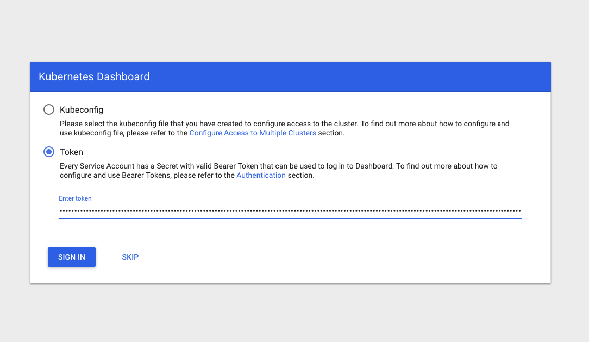
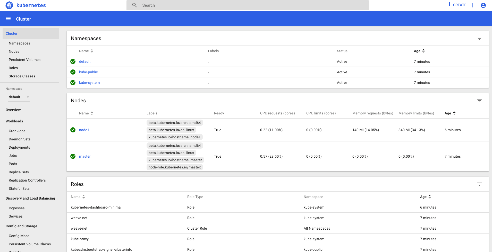

# Kubernetes The Awesome Way

>KTAW aka "Kubernetes The Awesome Way" is a turnkey multinode vagrant based Kubernetes cluster running on top of Debian GNU/Linux 9.

## 

**Why “Kubernetes The Awesome Way”?**

To give everyone the chance to get started with a multinode Kubernetes cluster just typing few commands, yes Make files are awesome :) .

DISCLAIMER - This is by no means a Kubernetes production grade setup, do not expose ports, services, endpoints to the internet.


**What is Kubernetes?**

According to the official [website](https://kubernetes.io/docs/concepts/overview/what-is-kubernetes/):

_Kubernetes is a portable, extensible open-source platform for managing containerized workloads and services, that facilitates both declarative configuration and automation. It has a large, rapidly growing ecosystem. Kubernetes services, support, and tools are widely available._


## Features

Pod network: Weave

Packages management: Helm

## Installation

**Requirements**

OS X & Linux:

- Ansible
- Virtualbox
- Vagrant
- Heml

**Setup**

```sh
git clone git@github.com:p0bailey/kubernetes-the-awesome-way.git
```


## Usage example

**Quickstart:**

To start and provision k8 cluster = `make kube_bootstrap`

To access k8 dashboard.

In one terminal type: `./proxy`

In another type:  `make kube_dashboard`

## 

## 

Whole KTAW menu.
```
kube_bootstrap                 Start and provision Kubernetes cluster.
kube_dashboard                 Open Kubernetes dashboard.
kube_get_token                 Retieve dashboard access token.
kube_join_node                 Joins new node into the cluster.
kube_status                    Show Kubernetes cluster status.
kube_up                        Start Kubernetes cluster.
kube_down                      Start Kubernetes cluster.
kube_Destroy                   Destroy Kubernetes cluster.

```


Other useful commands:

`./kubectl get pods --all-namespaces`

**Advanced:**


## Release History

* 0.0.1
    * First release, Helm and Weave support.

## Meta

Phillip Bailey– [@p0bailey](https://twitter.com/@p0bailey) – phillip.bailey@stack42.io

Distributed under the MIT license. See ``LICENSE`` for more information.

[https://github.com/p0bailey/kubernetes-the-awesome-way](https://github.com/p0bailey/kubernetes-the-awesome-way)

## Contributing

1. Fork it (<https://github.com/p0bailey/kubernetes-the-awesome-way>)
2. Create your feature branch (`git checkout -b feature/fooBar`)
3. Commit your changes (`git commit -am 'Add some fooBar'`)
4. Push to the branch (`git push origin feature/fooBar`)
5. Create a new Pull Request
